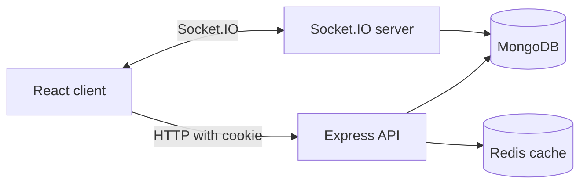

# atas

> A collaborative Markdown task manager for planning, writing, and sharing work with your team.

Atas is a full-stack task-management web application built with React and Node.js. Users can create Markdown tasks, organize them by status, share tasks with teams, collaborate in real time, track activity, and receive live notifications.

## Features

- Authentication with email/password and Google OAuth
- Markdown task editor with GitHub Flavored Markdown, syntax highlighting, and math rendering
- Task statuses: Pending, In Progress, and Complete
- Team-based task sharing with owner, editor, and viewer permissions
- Team-shared Kanban boards with real-time card movement and custom columns
- Real-time task collaboration through Socket.IO
- Presence indicators showing users in a task room and who is editing
- Debounced autosave while editing
- Dashboard statistics, recent tasks, and recent activity
- Activity log backed by MongoDB
- Task filtering by status, date order, and local/shared scope
- Redis caching with cache invalidation after writes
- Real-time notifications
- Responsive layouts for desktop, tablet, and mobile

## Tech Stack

### Frontend

- React 19
- Vite
- React Router
- Axios
- Tailwind CSS
- Socket.IO Client
- React Markdown
- Remark GFM and Remark Math
- Rehype Highlight, Rehype KaTeX, and Rehype Sanitize
- React Toastify

### Backend

- Node.js
- Express
- MongoDB with Mongoose
- Redis
- Socket.IO
- JWT stored in HTTP-only cookies
- Google OAuth
- Nodemailer
- Google Gemini API

## Project Structure

```text
AtasApp/
├── atas-app/             # React/Vite frontend
│   └── src/
│       ├── component/    # Reusable UI components
│       ├── context/      # Authentication and editor state
│       ├── layout/       # Header, navigation, and page shell
│       ├── pages/        # Dashboard, tasks, team, login, and log pages
│       └── utils/        # Shared frontend helpers
├── server/               # Express backend
│   ├── config/           # Authentication, Redis, and Socket.IO setup
│   ├── controllers/      # HTTP request handlers
│   ├── models/           # Mongoose schemas
│   ├── routes/           # API route definitions
│   ├── services/         # Cache, activity, notification, and dashboard logic
│   └── sockets/          # Real-time task room handlers
└── README.md
```

## How It Works



### Authentication

The client logs in through the account API. The server creates a JWT and stores it in an HTTP-only cookie. Protected Express routes validate that cookie before setting `req.user`. Socket.IO performs the same JWT validation during the socket handshake.

### Task workflow

1. The task list requests tasks using status, sort, and scope query parameters.
2. The server checks the authenticated user and team membership.
3. Redis serves cached task results when available.
4. MongoDB is queried on a cache miss.
5. Creating, editing, sharing, or deleting a task invalidates affected user and task caches.
6. The task editor joins a private Socket.IO room for real-time presence and content changes.
7. Debounced HTTP updates persist edits so the database remains the source of truth.

### Activity workflow

Activity records are stored once in the `Activity` collection. The activity log reads the full user history, while the dashboard reads only a small recent slice. This avoids maintaining two separate activity histories that could become inconsistent.

### Kanban board workflow

Users can create and select multiple named boards. New boards start with no columns. Board owners and authorized team editors can create named columns and rename them; the board allows up to six columns. Board owners can share a board with a team they own; that team's members can then find the board in their board list. Team viewers have read-only access. Manage team membership and invitations from the Team page.

The board view uses a horizontally scrollable, mobile-first column layout. While dragging, moving the pointer or touch point near either horizontal edge smoothly scrolls the board in that direction, making off-screen columns reachable on mobile. Auto-scroll continues only while the board can scroll in that direction and restarts when the pointer moves back to an edge. The board selector marks boards owned by someone else as shared. Board rendering is split into memoized card, column, and board-view components to keep interaction and layout logic focused. Card movement uses Socket.IO for live synchronization and authenticated HTTP requests for persistence. The board room shows the currently connected teammates. Column/card changes are recorded in each involved user's activity log.

Card descriptions support sanitized Markdown, GitHub Flavored Markdown, and math rendering in board cards and card previews.

### Notifications and teams

Team sharing and membership changes create notifications for affected users. Notifications are stored in MongoDB, delivered through Socket.IO when the recipient is online, and cached for subsequent reads.

## Getting Started

### Prerequisites

- Node.js 18 or newer
- npm
- MongoDB
- Redis
- Google OAuth credentials if Google login is enabled
- Gemini API credentials if AI features are enabled

### 1. Install dependencies

```bash
cd atas-app
npm install

cd ../server
npm install
```

### 2. Configure environment variables

Create `atas-app/.env`:

```env
VITE_API_BASE_URL=http://localhost:3000
VITE_GOOGLE_CLIENT_ID=your-google-client-id
```

Create `server/.env`:

```env
PORT=3000
NODE_ENV=development
ORIGIN_URI=http://localhost:5173
MONGODB_URI=mongodb://localhost:27017/atas-db
REDIS_URL=redis://localhost:6379
JWT_SECRET=replace-with-a-long-random-secret
JWT_FORGOT_PASS_SECRET=replace-with-a-long-random-secret
JWT_VERIFICATION_SECRET=replace-with-a-long-random-secret
GOOGLE_CLIENT_ID=your-google-client-id
EMAIL_USER=your-email-address
EMAIL_PASS=your-email-app-password
GEMINI_API_KEY=your-gemini-api-key
```

### 3. Start the development servers

Open two terminals from the repository root:

```bash
# Terminal 1
cd server
npm run dev
```

```bash
# Terminal 2
cd atas-app
npm run dev
```

The frontend runs at `http://localhost:5173` and the API runs at `http://localhost:3000` by default.

## Commands

### Frontend

| Command | Description |
| --- | --- |
| `npm run dev` | Start the Vite development server |
| `npm run build` | Create a production build |
| `npm run preview` | Preview the production build locally |
| `npm run lint` | Run Oxlint |

### Backend

| Command | Description |
| --- | --- |
| `npm run dev` | Start the server with Nodemon |
| `npm start` | Start the server with Node |

## API Areas

| Area | Base path | Purpose |
| --- | --- | --- |
| Accounts | `/api/account` | Registration, login, logout, verification, and profile access |
| Kanban boards | `/api/board` | Create, list, rename, share, and add columns to boards |
| Kanban cards | `/api/card` | Create, move, update, and delete board cards |
| Tasks | `/api/task` | Create, filter, read, update, and delete tasks |
| Teams | `/api/team` | Create and manage teams and members |
| Dashboard | `/api/dashboard` | Statistics, recent tasks, and recent activity summary |
| Activity | `/api/activity` | Authenticated activity history |
| Notifications | `/api/notification` | Read and mark notifications |
| AI | `/api/ai` | Gemini-powered task assistance |

## Task List Query Parameters

The task list supports these defaults:

```text
GET /api/task/get?status=all&sort=latest&scope=all
```

| Parameter | Values | Default |
| --- | --- | --- |
| `status` | `all`, `pending`, `in progress`, `complete` | `all` |
| `sort` | `latest`, `oldest` | `latest` |
| `scope` | `all`, `local`, `shared` | `all` |

## Collaboration Model

Each open task uses a private room named `task:<taskId>`. The server verifies the socket JWT and checks task ownership or team membership before allowing a user to join. Room events include:

- `task_presence`
- `task_editing`
- `task_change`

Socket events make the interface feel immediate, while debounced HTTP PATCH requests persist the task and allow the latest state to survive refreshes and reconnects.

## Security Notes

- Keep secrets in environment variables.
- Use different secrets for development and production.
- Do not expose MongoDB, Redis, JWT, mail, or Gemini credentials in client-side variables.
- Restrict CORS origins in production.
- Use HTTPS in production so authentication cookies remain protected.

## License

This project is currently intended for educational and portfolio use.
